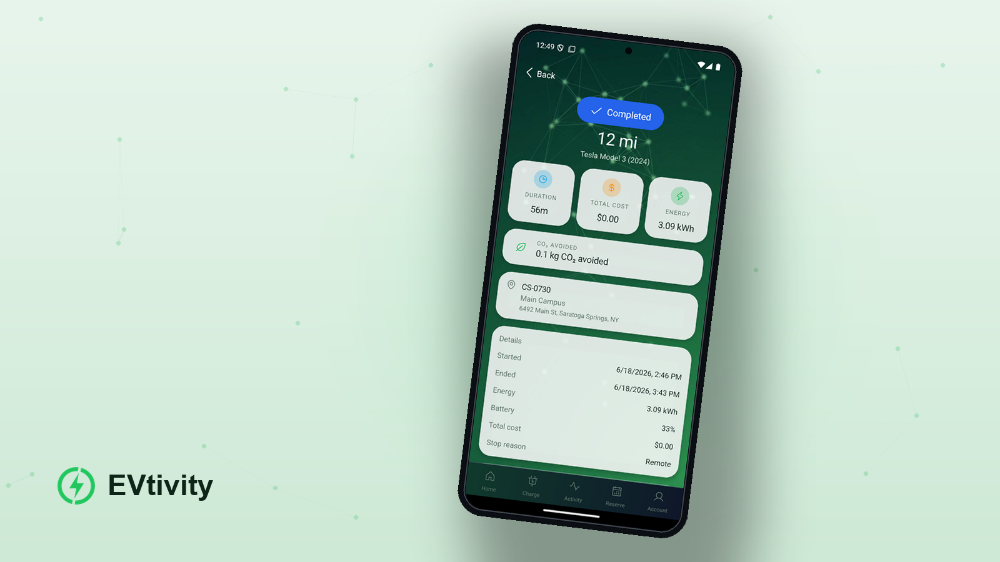

# EVtivity Mobile App

<p align="center">
  <a href="./LICENSE.md"></a>
  
  
  
  
</p>

<p align="center">
  <picture>
    <source media="(prefers-color-scheme: dark)" srcset="./docs/images/hero-dark.png">
    
  </picture>
</p>

Driver-facing mobile app for the EVtivity EV charging platform. It mirrors the
web driver portal as native iOS and Android, not a web view. The app is fully
self-contained: API client, types, state, i18n, and UI live in this repo with no
shared package and no cross-repo dependency. It talks to the EVtivity REST API
(`/v1/portal/*`) over Bearer auth at the active brand's `apiUrl`. It ships six
languages: English, Spanish, Simplified Chinese, German, Korean, and Traditional
Chinese.

The app is white-label. An operator forks the repo, adds a brand under
`brands/`, sets `ACTIVE_BRAND`, and ships to the App Store and Play Store under
their own developer accounts. Builds are free locally and in GitHub Actions; no
paid EAS cloud subscription is required.

## Stack

| Concern | Choice |
|---|---|
| Framework | Expo SDK 52 + React Native 0.76, New Architecture |
| Routing | Expo Router (file-based) |
| Styling | NativeWind v4 (Tailwind for React Native) |
| Data fetching | TanStack Query |
| Client state | Zustand |
| i18n | i18next + react-i18next |
| Icons | lucide-react-native |
| Payments | @stripe/stripe-react-native (native PaymentSheet) |
| Secure storage | expo-secure-store (Keychain / Keystore) |
| Biometrics | expo-local-authentication |
| Push | expo-notifications (APNs + FCM) |
| Camera | expo-camera (QR scan) |
| Build / CI | Expo CLI + EAS CLI `--local` + GitHub Actions |

## Quick start

```bash
npm install
cp .env.example .env        # set ACTIVE_BRAND, optionally EXPO_PUBLIC_API_URL
npx expo start              # runs the JS app in the dev client / Expo Go
```

`npx expo start` runs the JavaScript app against a simulator or device without
producing a native binary. Press `i` for the iOS simulator or `a` for the
Android emulator from the running dev server.

## Run on a simulator or device

```bash
npx expo run:ios           # build and run the iOS debug app (macOS + Xcode)
npx expo run:android       # build and run the Android debug app (Android Studio)
```

These compile a native debug binary and install it on the simulator or a
connected device. For a physical device, enable developer mode and trust the
build.

## Native binaries

Native release binaries are produced locally with `eas build --local` or by the
GitHub Actions workflows in `.github/workflows/`. Building requires Xcode on
macOS for iOS and Android Studio with JDK 17 for Android. The JS dev server does
not produce store-ready binaries.

## Documentation

- [SETUP.md](./SETUP.md) - prerequisites and local build instructions
- [WHITELABEL.md](./WHITELABEL.md) - create and ship an operator brand
- [SECURITY.md](./SECURITY.md) - security posture and roadmap
- [LICENSE.md](./LICENSE.md) - Business Source License 1.1

## License

EVtivity Mobile is licensed under the Business Source License 1.1, the same
license as the EVtivity CSMS. Free production use is limited to a single charging
network: you may build, publish, and operate one branded driver app for your own
network at no cost. The "one codebase, many brands" capability is a build-time
feature, not a grant to run apps for multiple independent networks for free.
Operating or publishing branded versions of the app for more than one independent
charging network (white-label as a service, resale, or multi-tenant platforms)
requires a commercial license. Development, testing, demonstration, educational,
and non-profit use are always permitted. See [LICENSE.md](./LICENSE.md) for the
full terms, or contact evtivity@gmail.com for commercial licensing.
